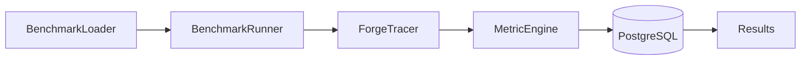

# Forge Architecture

Forge captures multi-step agent runs, scores them across seven process-aware metrics, persists results, and serves them through an API and dashboard. The layered flow below reflects the implemented system.

## System Layers

```mermaid
graph TB
    A[LangChain Agent]

    T[ForgeTracer<br/>LangChain callback]

    TR[Trajectory<br/>JSON schema v2]
    TRN[["Key fields:<br/>trajectory_id, task, steps,<br/>conversation_history, retrieved_context"]]

    ME[MetricEngine]
    M1[TaskCompletion]
    M2[ToolCallFidelity]
    M3[StepEfficiency]
    M4[ReasoningCoherence]
    M5[HallucinationScore]
    M6[RecoveryRate]
    M7[MultiTurnConsistency]

    PG[(PostgreSQL)]
    PGN[["Tables:<br/>trajectories, evaluations, benchmark_runs"]]

    API[FastAPI]
    APIN[["Endpoints:<br/>/evaluate, /benchmark/run, /leaderboard,<br/>/compare, /trajectories/&#123;id&#125;, /health"]]

    UI[React Dashboard]
    CI[CI GitHub Action]
    CLI[CLI scripts]

    A --> T
    T --> TR
    TR -.- TRN
    TR --> ME
    ME --> M1
    ME --> M2
    ME --> M3
    ME --> M4
    ME --> M5
    ME --> M6
    ME --> M7
    ME --> PG
    PG -.- PGN
    PG --> API
    API -.- APIN
    API --> UI
    API --> CI
    API --> CLI
```

A LangChain agent runs while the `ForgeTracer` callback records every LLM and tool event into a `Trajectory`. The `MetricEngine` scores that trajectory with seven metrics and writes scores to PostgreSQL, which FastAPI reads to power the dashboard, CI gate, and CLI tooling.

## Benchmark Execution Flow

The BenchmarkLoader reads benchmark tasks from data/benchmark/ and passes them to the BenchmarkRunner for execution., and the `BenchmarkRunner` invokes the agent on each — injecting a `ForgeTracer` at invocation time for native `AgentExecutor` dispatch. Captured trajectories flow through the `MetricEngine` into PostgreSQL, and aggregate results surface on the leaderboard.

## Notes

The `Trajectory` v2 schema carries `conversation_history` (multi-turn exchanges) and `retrieved_context` (RAG chunks) as optional fields, consumed by `MultiTurnConsistency` and `HallucinationScore` respectively. Structural metrics (StepEfficiency, ToolCallFidelity, RecoveryRate) require no model calls, so a deterministic subset runs in CI on every pull request.
